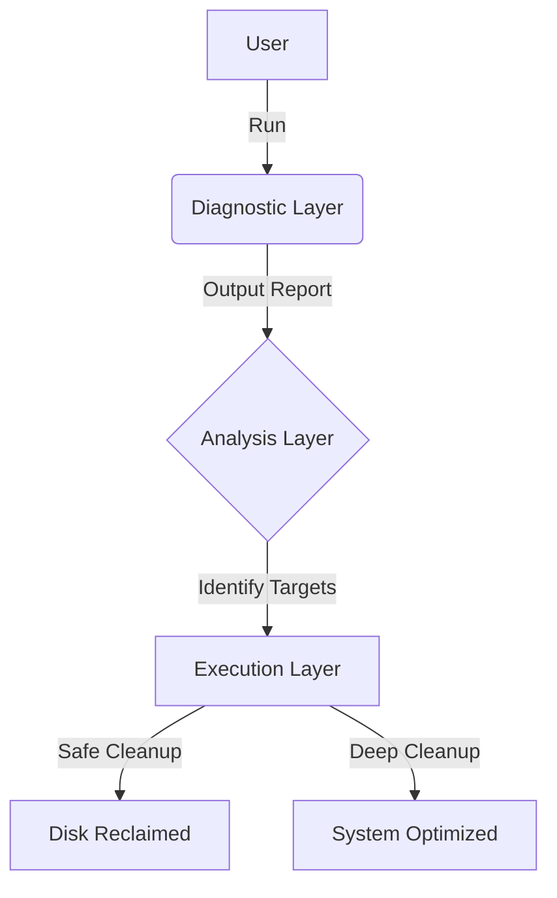

# 🔧 WinDiagKit

<div align="center">
  <h3>Windows System Diagnostic & Optimization Toolkit</h3>
  <p>
    Born from necessity. Built for performance. Optimized for developers.
  </p>
  
  <p>
    <a href="https://github.com/SH1W4/WinDiagKit/issues">
      
    </a>
    <a href="https://github.com/SH1W4/WinDiagKit/pulls">
      
    </a>
    <a href="LICENSE">
      
    </a>
    
    
  </p>
</div>

---

**WinDiagKit** represents a professional approach to Windows system maintenance. Originally created to rescue a development machine with critical disk space (5% free), it evolved into an Enterprise-grade toolkit that saved **19.7 GB (+82% capacity)** without deleting a single line of code.

## 🚀 Why WinDiagKit?

- **🛡️ Safe by Design:** Intelligent scripts that distinguish between *cache* (safe to delete) and *data* (must preserve).
- **🐳 Dev-Aware:** Specifically optimized for developers using Docker, Node.js, Python/Anaconda, and VSCode/Cursor.
- **⚡ Zero-Install:** Pure PowerShell. No binaries to install. Transparent code you can read.
- **🏗️ Enterprise Architecture:** Built with proper separation of concerns (Diagnostic -> Analysis -> Execution).

## ✨ Key Features

### 🔍 Deep Diagnostics
- **Storage CSI:** Forensically analyze where every GB is going (User root, AppData, ProgramData).
- **Docker Inspection:** Identify dangling images, stopped containers, and orphan volumes.
- **Dev Environment Audit:** Verify toolchains (Git, Python, Node, Rust) and their footprints.

### 🧹 Intelligent Cleanup
- **Cursor/VSCode Optimization:** Cleans cached update installers and backup databases while keeping settings intact.
- **Docker Prune Strategy:** Smart cleaning that respects active containers.
- **Anaconda Reclamation:** Safely removes unused Python distributions (often 10GB+).
- **Browser Hygiene:** Cleans caches for Chrome/Edge without losing history or cookies.

## 🚀 Quick Start

### 1. Diagnostic Scan (Read-Only)
Check your system health without changing anything:
```powershell
.\scripts\diagnostic\SystemDiagnosticUser.ps1
```

### 2. Analysis
Find who is eating your disk space:
```powershell
.\scripts\analysis\ScanStorage.ps1
```

### 3. Safe Cleanup
Run safe optimizations (caches, temp files):
```powershell
.\scripts\cleanup\AdditionalCleanup.ps1
```

### 4. Full Optimization (Admin)
Deep cleaning including system hibernation and post-reboot tasks:
```powershell
# Run as Administrator
.\scripts\cleanup\PostRebootCleanup.ps1
```

## 🏗️ Architecture

WinDiagKit follows a layered architecture pattern:



See [ARCHITECTURE.json](ARCHITECTURE.json) for detailed specifications.

## 📊 Real-World Results

Case study from the original "Rescue Mission" (v1.0.0):

| Component | Before Usage | After Usage | Reclaimed |
|-----------|--------------|-------------|-----------|
| **Cursor Cache** | 13.0 GB | 6.5 GB | **6.5 GB** |
| **Docker** | 25.0 GB | 0.3 GB | **24.7 GB** |
| **Anaconda** | 9.4 GB | 0.0 GB | **9.4 GB** |
| **System Cache** | 6.3 GB | 0.0 GB | **6.3 GB** |
| **Total** | **5% Free** | **9.2% Free** | **+19.7 GB** |

## ⚠️ Important Notes

- **Username Changes:** We strongly advise **AGAINST** renaming your Windows user folder. See [our detailed guide](docs/DEPRECATED_USERNAME_CHANGE.md) on why this is risky.
- **Hibernation:** Disabling hibernation (`powercfg -h off`) frees 3-6GB but disables Fast Startup. Re-enable with `powercfg -h on`.

## 🤝 Contributing

we welcome contributions! Please check [CONTRIBUTING.md](CONTRIBUTING.md) and our [Security Policy](SECURITY.md).

## 📝 License

Licensed under the [MIT License](LICENSE).

---
<div align="center">
  <sub>Made with ❤️ by <a href="https://github.com/SH1W4">SH1W4</a></sub>
</div>
