# 🪐 Orbit-DevOps

<div align="center">
  
  <br/><br/>
  
  <h3>The Developer's Workspace Command Center</h3>
  <p><b>Diagnose. Optimize. Compact. Control.</b></p>

  <p>
    
    
    
    
    
  </p>
</div>

---

**Orbit-DevOps** is a professional-grade, **universal** CLI toolkit and **Algebraic Reasoning Engine** designed to reclaim GBs of "ghost" storage and optimize development stacks across **Windows, Linux, and macOS**.

> [!IMPORTANT]
> **Read the [Orbit Thesis & Manifesto](./THESIS.md)** and the official **[Technical Manifesto (Preprint)](./docs/ORBIT_MANIFESTO.md)** to understand the philosophy of **Biological Provisioning**, **Algebraic Reasoning**, and **Agentic Infrastructure**.

## 🗺️ EAP & Roadmap (Work Breakdown Structure)

```mermaid
graph TD
    Orbit["🪐 Orbit-DevOps Ecosystem"] --> Core["⚙️ Core Engine (v1.4.0)"]
    Orbit --> Agentic["🤖 Agentic Layer"]
    Orbit --> Genome["🧬 Genome Library"]
    Orbit --> Authority["🎓 Authority Layer"]
    Orbit --> Universal["🌐 Universal UI (Roadmap)"]

    Core --> PWin["Windows Provider (PS7)"]
    Core --> PUnix["Unix Provider (Linux/macOS)"]
    Core --> Diag["Diagnostic Scanners"]

    Agentic --> MCP["MCP Server Integration"]
    Agentic --> Hybrid["Hybrid Evolutionary Logic"]
    Agentic --> Skills["Skill Maps (.agent/skills)"]

    Genome --> GRepo["agent-stack-dev Repo"]
    Genome --> Templates["Static DNAs"]
    Genome --> Mutate["Adaptive Rules"]
    Genome --> Algebra["🔢 Symbiotic Algebra"]

    Agentic --> Reasoning["Logic Reasoning Engine"]

    Authority --> LaTeX["arXiv/LaTeX Manifesto"]
    Authority --> Visual["Visual Logic Mapping"]
    Authority --> Zero["Protocol Zero (Security)"]

    Universal --> Dash["Web Dashboard (Vite)"]
    Universal --> iOS["iOS Control Center"]
    Universal --> PWA["PWA Mobile App"]

    style Universal fill:#2d3436,stroke:#333,stroke-dasharray: 5 5
    style Core fill:#00b894,color:#fff
    style Agentic fill:#6c5ce7,color:#fff
    style Genome fill:#fdb827,color:black
    style Authority fill:#e84393,color:#fff
```



## 🚀 One-Minute Start

Run without installing:
```bash
npx @symbeon/orbit-devops doctor
```

Or install globally:
```bash
npm install -g @symbeon/orbit-devops
```

## ✨ Core Superpowers

<div align="center">
  
</div>
<br/>

| Command | Platform | Action |
| :--- | :--- | :--- |
| `orbit doctor` | 🌍 All | **Full System Scan**: OS, RAM, and Storage health. |
| `orbit space` | 🌍 All | **Storage Forensics**: Find large "ghost" folders. |
| `orbit clean` | 🌍 All | **Smart Sanitation**: Caches, logs, and temp files. |
| `orbit compact`| 🪟 Win | **WSL2 Compactor**: Reclaim space from VHDX disks. |
| `orbit sync` | 🌍 All | **Genome Sync**: Sync environment DNA to the library. |

## 🛠️ Universal Requirements
- **Windows**: PowerShell 7+
- **Linux/macOS**: POSIX shell with Node.js 18+
- **Genome Library**: Linked via [agent-stack-dev](https://github.com/SH1W4/agent-stack-dev)

---
<div align="center">
  <sub>Built with ❤️ by <a href="https://github.com/SH1W4">Symbeon Labs</a></sub>
</div>