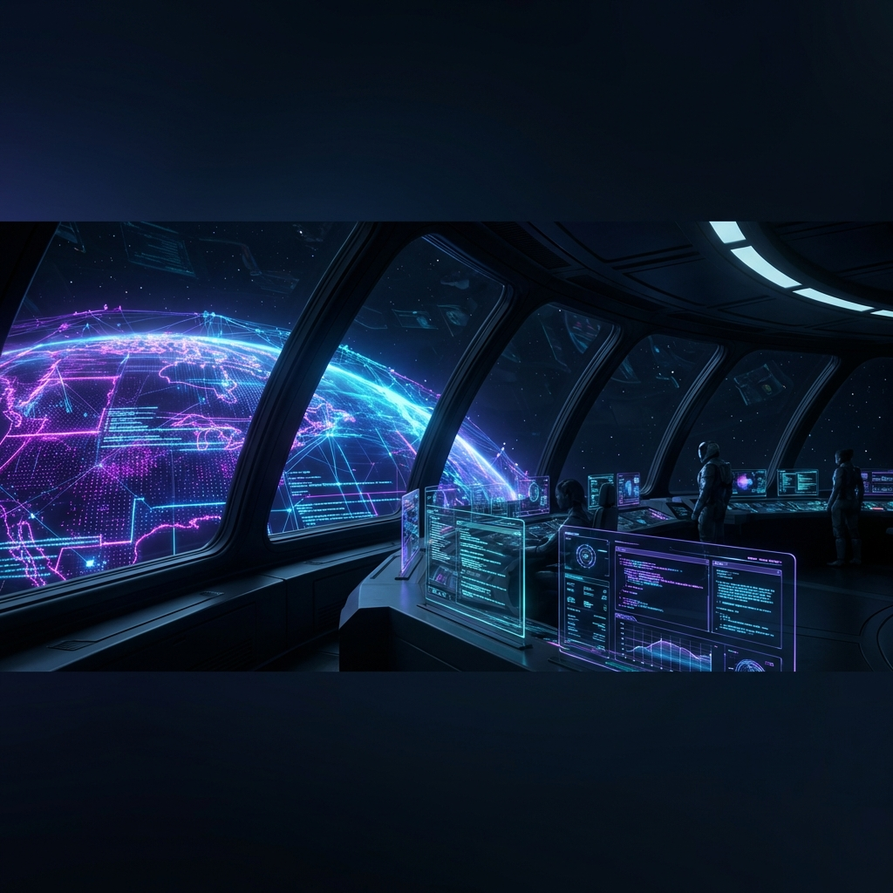
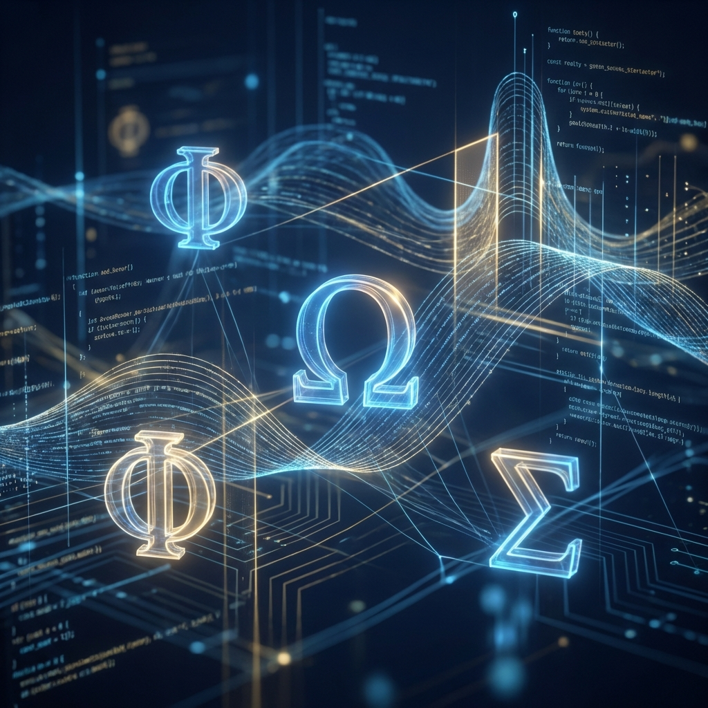
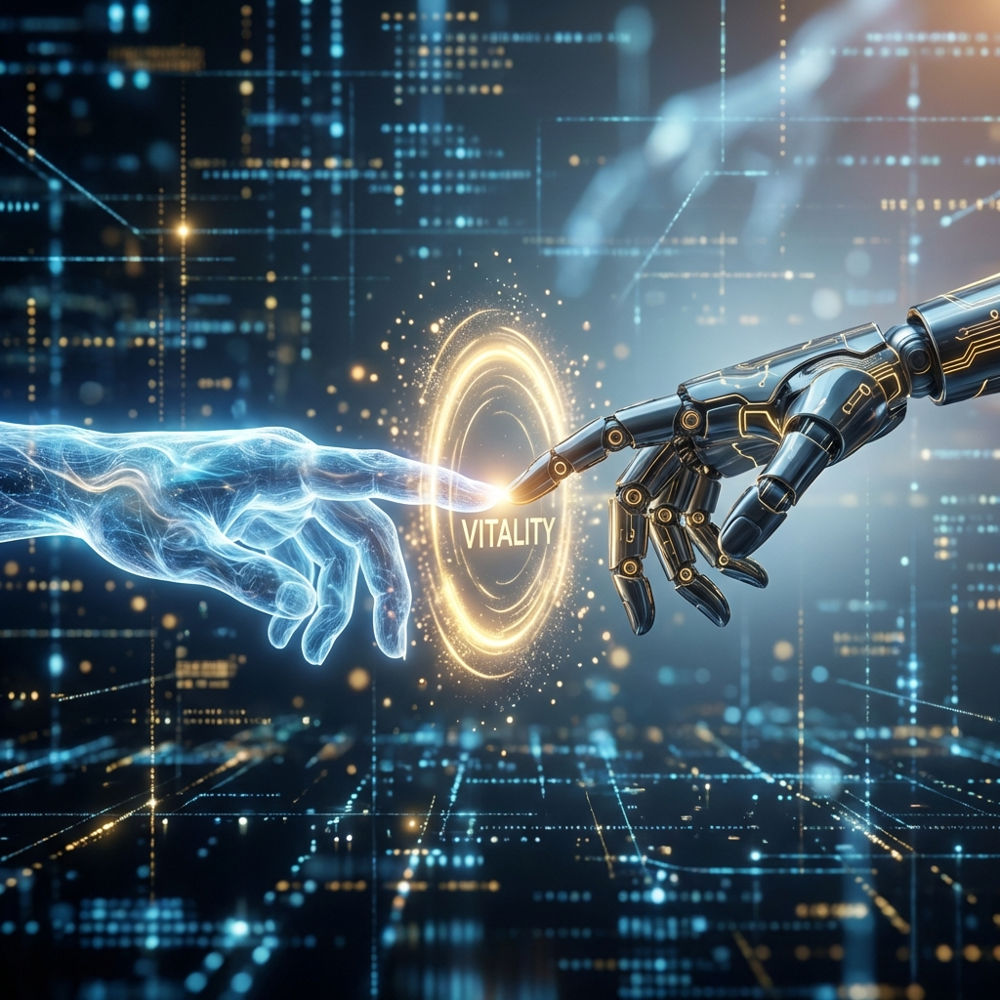

# 🖼️ Orbit-DevOps: Galeria de Ativos Visuais

Esta galeria contém os ativos visuais oficiais gerados para a identidade da **Symbeon Labs** e do projeto **Orbit**. Estes conceitos visualizam a filosofia da *Mathematica Orbitae* e da *Infraestrutura Simbiótica*.

## 1. Banner Oficial do Comando
Uma visão panorâmica do "Bridge" do Orbit. Representa o controle soberano sobre a infraestrutura global.

---

## 2. O Core Algébrico ($\Omega, \Phi, \Sigma$)
Visualização abstrata do motor de raciocínio. Símbolos gregos de Entropia, Vitalidade e Simbiose flutuando em um nexo de código e luz.

---

## 3. Caçada Fantasma (Ghost Hunt)
Conceito artístico da operação de saneamento cirúrgico. Um scanner futurista isolando blocos de entropia (vermelho) em um fluxo de vitalidade (azul).

---

## 4. Homeostase Simbiótica
A representação do "Handshake" entre o Agente e a Máquina. O anel dourado representa a Vitalidade gerada pelo alinhamento perfeito.

---
**Ativos de Propriedade da Symbeon Labs.** 🪐🛡️✨
