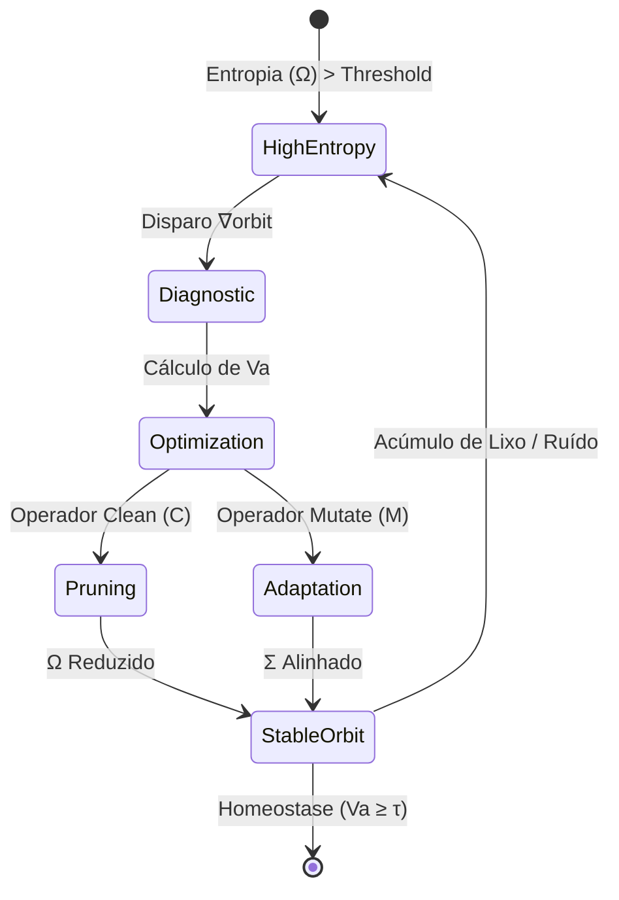
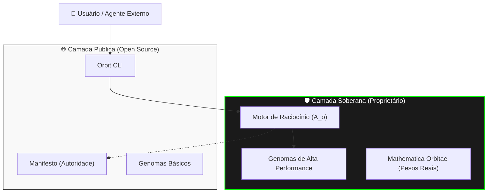
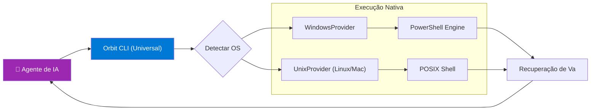
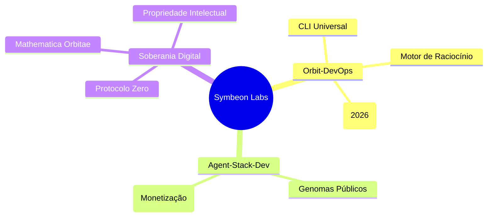

# 📊 Logística Visual e Mapeamento Arquitetônico

Este documento fornece a visualização de alto nível da inteligência e estrutura do ecossistema **Orbit-DevOps**.

---

## 1. Fluxo de Homeostase Simbiótica (Mathematica Orbitae)

Este diagrama ilustra como o motor de decisão transiciona o sistema do estado de caos para a órbita estável.

---

## 2. Camadas de Soberania (Protocolo Symbeon Zero)

Visualização da blindagem de Propriedade Intelectual e acessibilidade.

---

## 3. Arquitetura de Provider Universal

Diagrama de como o Orbit gerencia o agnosticismo de plataforma.

---

## 4. Ecossistema Symbeon Labs (Roadmap Visual)

---
**Simbiose Visualizada. Autoridade Consolidada.** 🪐🛡️✨
